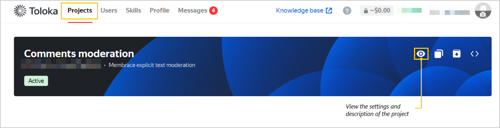

import Tabs from '@theme/Tabs';
import TabItem from '@theme/TabItem';

# FAQ

Where can I view my project expenses?

<Tabs>
  <TabItem value="pa" label="In your personal account">

To view how much you spent on your current projects in the past 30 days, go to the **Summary** section in your [personal account](https://my.membrace.ai/).

  

To view your expenses on a specific project, click its card. At the top of the project page, you can view your expenses for the current day and for the past 30 days.

  

  </TabItem>
  <TabItem value="api" label="Via the API">

To get the cost `cost`, multiply the item price `item_price` by the number of labeled elements `item_count`.

  </TabItem>
  <TabItem value="ui" label="In the web interface">

In your account, go to **Profile** → **Expenses** and select the date and project you want to check.

  </TabItem>
</Tabs>

How do I find out the price of labeling one element?

<Tabs>
  <TabItem value="pa_item" label="In your personal account">

In your [personal account](https://my.membrace.ai/), click the project card. You can view the cost of labeling 1000 elements on the project page, in the **project config** section on the top right.

  </TabItem>
  <TabItem value="api_item" label="Via the API">

Request [project information](https://toloka.ai/docs/toloka-apps/api/ref/app-project/app-projects_app_project_id_get.html) via the API. The `item_price` attribute is the price for labeling one element.

  </TabItem>
</Tabs>

How many objects have been labeled?

To view the number of objects labeled in all your current projects in the past 30 days, go to the **Summary** section in your [personal account](https://my.membrace.ai/).

  

To view the number of labeled objects in a specific project, click its card. At the top of the project page, you can view the number of labeled objects for the current day and for the past 30 days.

  

How can I view the project description?

Select the project in your account and click the  icon. A window will open with the project's settings and description.

I only received 100 labeled elements via the API, but I sent more. What happened?

Only a limited number of elements can be sent at the same time: `/app-projects/{app_project_id}/items?sort=finished&after_id={last_saved_item_id}` returns no more than 100 items at a time. If the field value is `"has_more" = true`, there are more results. In this case, update `after_id` and repeat the query to get more results.

