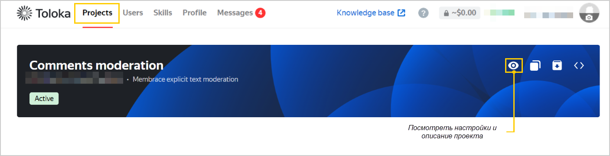

# FAQ

Как узнать расходы по проекту?

<Tabs>
  <TabItem value="ui" label="В веб-интерфейсе">

В кабинете заказчика на вкладке **Профиль** → **Затраты** выберите дату, за которую вы хотите посмотреть расходы, и необходимый проект.

  </TabItem>
  <TabItem value="api" label="Через API">

Чтобы получить стоимость `cost`, умножьте цену элемента `item_price` на количество размеченных элементов `item_count`.

  </TabItem>
</Tabs>

Как узнать цену разметки одного элемента?

Через API запроситe [информацию о проекте](https://toloka.ai/docs/toloka-apps/api/ref/app-project/app-projects_app_project_id_get.html) атрибут `item_price` — цена разметки одного элемента.

Как посмотреть описание проекта?

В кабинете заказчика на соответствующей вкладке выберите необходимый проект и нажмите значок . В открывшемся окне отобразятся настройки и описание проекта.

По API я получил размеченными только 100 элементов, но отправлял на разметку больше. Почему?

Существует ограничение по количеству одновременно передаваемых элементов — `/app-projects/{app_project_id}/items?sort=finished&after_id={last_saved_item_id}` возвращает не более 100 элементов за один раз. Если значение поля `"has_more" = true`, значит есть еще результаты. В этом случае обновите `after_id` и повторите запрос для получения следующих результатов.

