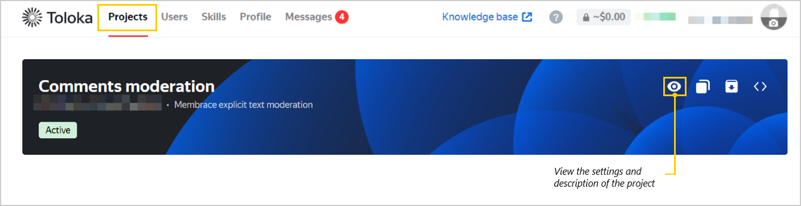

import Tabs from '@theme/Tabs';
import TabItem from '@theme/TabItem';

# FAQ

  
Where can I view my project expenses?

  

<Tabs>
  <TabItem value="ui" label="In the web interface">

In your account, go to **Profile** → **Expenses** and select the date and project you want to check.

  </TabItem>
  <TabItem value="api" label="Via the API">

To get the cost `cost`, multiply the item price `item_price` by the number of labeled elements `item_count`.

  </TabItem>
</Tabs>

  

  
How do I find out the price of labeling one element?

  

Request [project information](https://toloka.ai/docs/toloka-apps/api/ref/app-project/app-projects_app_project_id_get.html) via the API. The `item_price` attribute is the price for labeling one element.

  

  
How can I view the project description?

  

Select the project in your account and click the  icon. A window will open with the project's settings and description.

  

  
I only received 100 labeled elements via the API, but I sent more. What happened?

  

Only a limited number of elements can be sent at the same time: `/app-projects/{app_project_id}/items?sort=finished&after_id={last_saved_item_id}` returns no more than 100 items at a time. If the field value is `"has_more" = true`, there are more results. In this case, update `after_id` and repeat the query to get more results.

  

